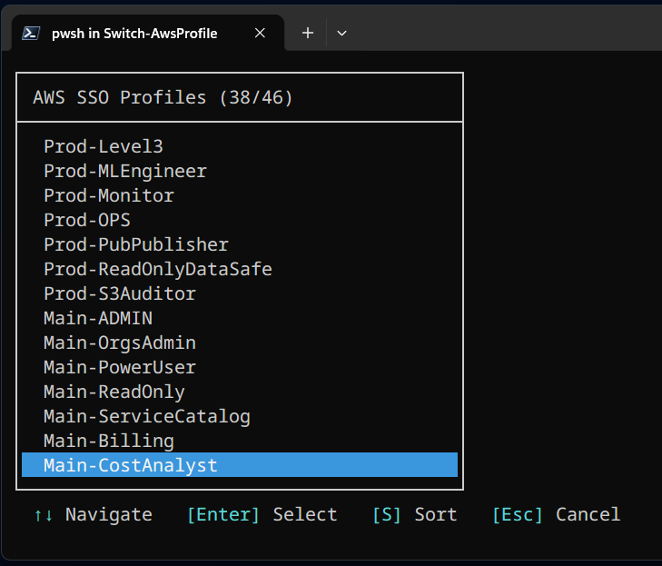

# Switch-AwsProfile.ps1 (aka "sap")

Interactive PowerShell tool for switching between AWS SSO profiles.

[](https://github.com/michaelsanford/Switch-AwsProfile/actions/workflows/lint.yml)
[](https://github.com/michaelsanford/Switch-AwsProfile/actions/workflows/release.yml)

## Features

- Reads profiles from `~\.aws\config` in file order, with optional A→Z / Z→A sort
- Arrow key, Page Up/Down navigation with scrolling viewport
- Bordered interactive menu with key hints
- Sets `AWS_PROFILE` in the current shell
- Automatically triggers `aws sso login`

## Usage

```powershell
sap
```

| Key | Action |
|-----|--------|
| `↑` / `↓` | Move selection |
| `PgUp` / `PgDn` | Jump half a page |
| `S` | Cycle sort mode (file order → A→Z → Z→A) |
| `Enter` | Select profile and login |
| `Esc` | Cancel |



## Installation

The script defines a `Switch-AwsProfile` function and a `sap` alias. Dot-sourcing it once in `$PROFILE` loads both at shell startup — no wrapper function needed.

### Quick Setup (PowerShell)

```powershell
# Copy script to a persistent location
$scriptsDir = "$env:LOCALAPPDATA\Scripts"
New-Item -ItemType Directory -Path $scriptsDir -Force
Copy-Item .\Switch-AwsProfile.ps1 $scriptsDir\

# Append a dot-source line to $PROFILE
Add-Content -Path $PROFILE -Value "`n# AWS Profile Switcher`n. `"$scriptsDir\Switch-AwsProfile.ps1`""

# Load it now without restarting the shell
. $PROFILE
```

### Manual Installation

1. Copy `Switch-AwsProfile.ps1` to any permanent location, e.g. `%LOCALAPPDATA%\Scripts\`.
2. Add one line to your PowerShell profile (`$PROFILE`):

   ```powershell
   . "$env:LOCALAPPDATA\Scripts\Switch-AwsProfile.ps1"
   ```

3. Reload: `. $PROFILE`

`Switch-AwsProfile` and `sap` are now available in every new shell session.

## Requirements

- [PowerShell 7+](https://learn.microsoft.com/en-us/powershell/scripting/install/installing-powershell-on-windows)
- [AWS CLI](https://docs.aws.amazon.com/cli/latest/userguide/getting-started-install.html) installed
- Configured AWS SSO profiles in `~\.aws\config`

## Recommended

[Oh My Posh](https://ohmypo.sh/docs/installation/windows) enhances your PowerShell prompt with themes and AWS profile display.

[Here's my configuration](https://gist.github.com/michaelsanford/0ff562591a78f6815bb72fc879aead01).

---

## Bash/Zsh Version

A bash/zsh port is available as `switch-aws-profile.sh`.

### Installation

```bash
# Copy to a directory in your PATH
mkdir -p ~/.local/bin
cp switch-aws-profile.sh ~/.local/bin/sap
chmod +x ~/.local/bin/sap

# Add a sourcing wrapper to ~/.bashrc or ~/.zshrc
echo 'sap() { source ~/.local/bin/sap; }' >> ~/.bashrc  # or ~/.zshrc
source ~/.bashrc  # or source ~/.zshrc
```

The wrapper sources the script so `AWS_PROFILE` persists in the current shell.

> **Note:** Natural number sorting (`Admin-2` before `Admin-10`) requires GNU coreutils
> `sort -V`, available by default on Linux and via Homebrew (`brew install coreutils`) on macOS.
